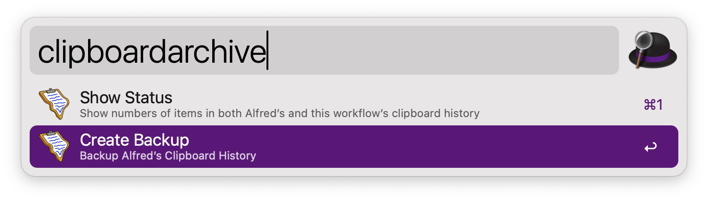
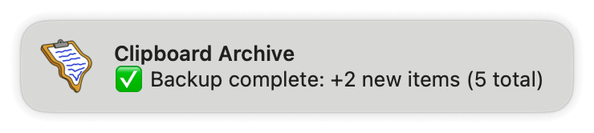
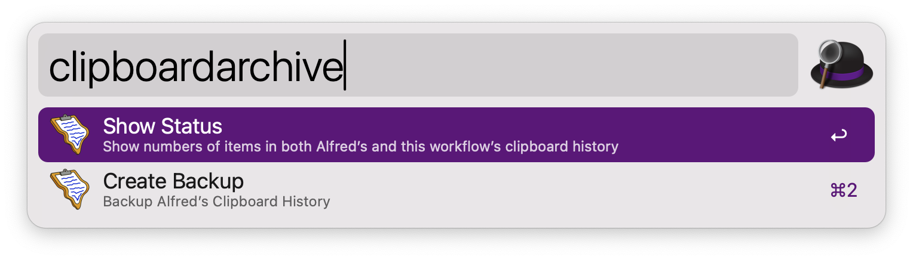
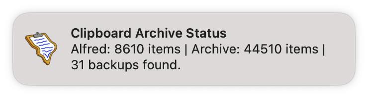
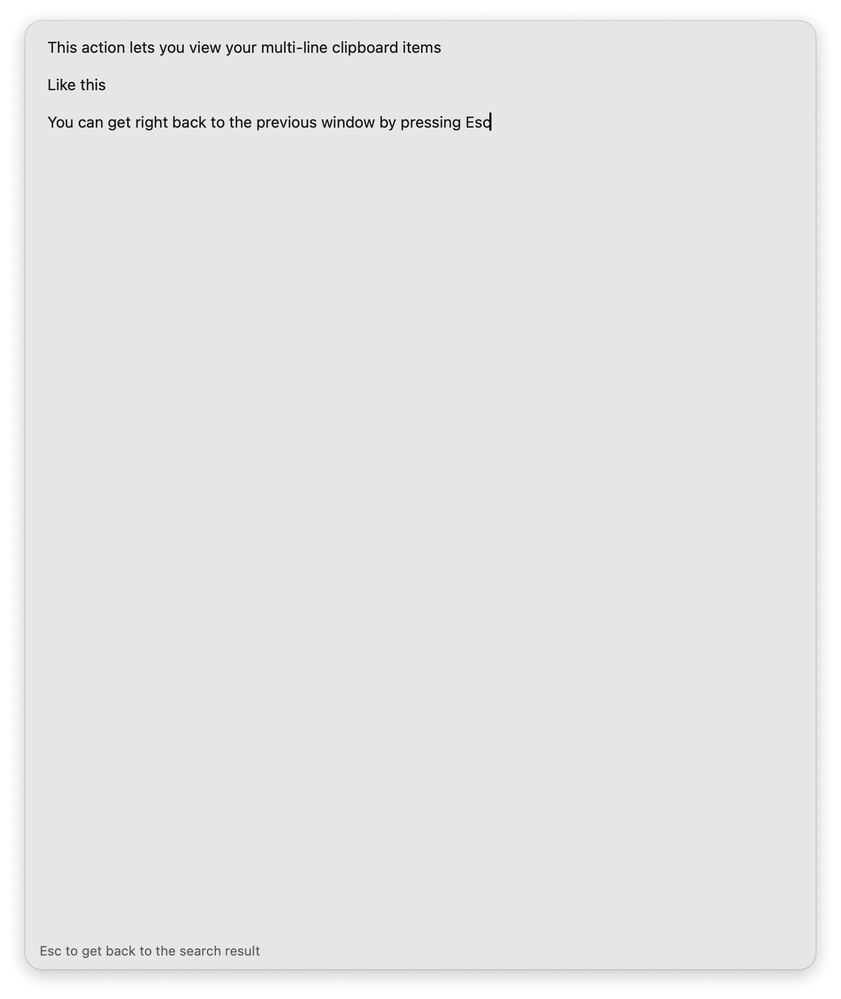

#  Clipboard History Archive — An Alfred Workflow

[➡️ Download the latest release](../../releases/latest)

Backup Alfred’s clipboard history so it doesn’t expire!

Alfred’s Clipboard History can only keep items copied within 3 months at most. With this workflow you can have unlimited amount of items ready to search for. 

This workflow lets you backup data from Alfred’s Clipboard History (only texts will be backed up). Merge the backed up data to a master database (without duplications). And search in the master database. 

*You will need to specify a directory first. Inside the ‘Configure Workflow…’ button, find ‘Backup to’ option and select a folder you want to backup to.*

## Backup

Invoke the `clipboardarchive` keyword (can be customized inside ‘Configure Workflow…’ button) and choose ‘Backup to …’ option.

All your data will be backed up to the directory you specified inside ‘Configure Workflow…’. A new ‘all.sqlite3’ database will be created to store all backed up items from now on if you have no backups.

## Check Status

Shows you how many items are currently in Alfred’s Clipboard History database and your master database (if you have backed up before).

Invoke the `clipboardarchive` keyword (can be customized inside ‘Configure Workflow…’ button) and choose ‘Status of …’ option.

## Search

Invoke the `clipboardsearch` keyword (can be customized inside ‘Configure Workflow…’ button) or the hotkey ⌘⌥X (can be customized by editing the Hotkey object) and start typing. 

Clipboard items matching your query will show in the result. 

You can hit ↵ to view the item in Alfred’s Text View (Alfred 5.5 required), hit ⌃↵ to copy the item to clipboard or  hit ⌘↵ to paste the item to front-most app. When you are in the preview window, you can get right back to the previous list window by pressing Esc.

Inspired by a [topic](https://www.alfredforum.com/topic/10969-keep-clipboard-history-forever/?do=findComment&comment=68859) on the Alfred Forum. The backup function is base on a modified version of [theSquashSH](https://www.alfredforum.com/profile/4058-thesquashsh/)’s [script](https://gist.github.com/pirate/6551e1c00a7c4b0c607762930e22804c).
